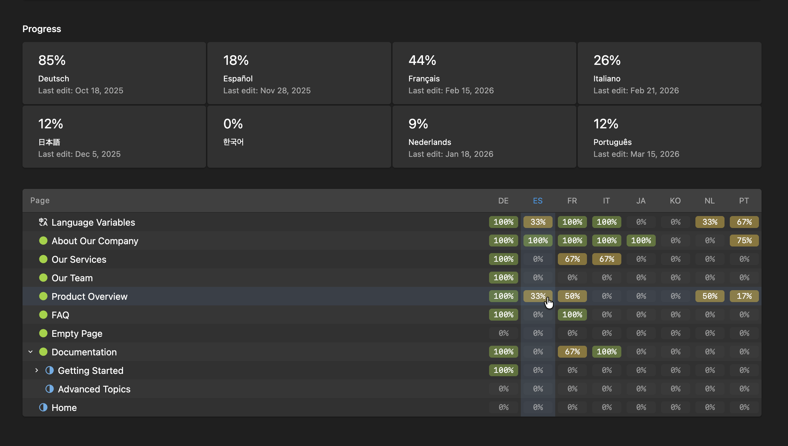

# Kirby Translation Progress

Extends the Panel's Languages view with a translation overview: a completion percentage per language and a collapsible page tree showing per-page progress.



## Installation

### Composer

```bash
composer require medienbaecker/kirby-translation-progress
```

### Manual

Download and extract to `site/plugins/kirby-translation-progress`.

## Requirements

- Kirby 5+
- PHP 8.2+
- Multi-language setup

## How it works

The plugin reads Kirby's content files, compares them field by field against the default language, and reports a percentage.

Pages _without_ a content file for a language are marked as **missing**. A field is considered **translated** when its content differs from the default language. A field that's empty in the translation counts as **untranslated**. A field that's identical to the default language is where it gets tricky:

### Identical content

When a field has the same value in both languages, is it translated or not? "API" in English is "API" in German and that's fine. But a full paragraph that's identical in both languages probably hasn't been translated yet.

The plugin uses a length heuristic: identical values shorter than `minValueLength` (default: 50 characters) are assumed to be loan words or proper nouns. Longer identical values are flagged as untranslated.

### Field types

The plugin reads the blueprint to find translatable fields. Fields with `translate: false` are excluded, and so are non-text types (`files`, `pages`, `users`, `link`, `color`, `date`, `time`) that don't contain translatable content.

For complex fields, the plugin extracts text before comparing:

| Field type         | What gets compared                    |
| ------------------ | ------------------------------------- |
| `text`, `textarea` | The raw value                         |
| `writer`, `list`   | HTML with tags stripped               |
| `blocks`           | Text from each block's content fields |
| `layout`           | Text from blocks inside each column   |
| `structure`        | Each sub-field per row, individually  |
| `object`           | Each sub-field individually           |
| `tiptap`           | Text nodes from ProseMirror JSON      |

Object and structure fields are expanded recursively, nested compounds (e.g. a structure inside an object) should work too.

### Language variables

The `translations` array from your language files is also compared, shown as a separate row. Disable it with `languageVariables: false`.

## Options

```php
'medienbaecker.translation-progress' => [
    'minValueLength'    => 50,
    'languageVariables' => true,
    'ignoreFieldTypes'  => ['files', 'pages', 'users', 'link', 'color', 'date', 'time'],
    'ignoreVariable'    => null,
    'ignoreField'       => null,
    'ignorePage'        => null,
    'adapters'          => [],
],
```

> [!TIP]
> Use Kirby's built-in `translate: false` option in your blueprints to exclude specific fields from secondary languages:
>
> ```yaml
> fields:
>   category:
>     type: select
>     translate: false
> ```

### Ignoring content

Some content keeps a language from ever reaching 100% even when nothing's wrong: a language variable that happens to read the same as the default in most languages (a unit or shared term like `{{time}} min`), a field that doesn't need translating, or an entire page type. Three callbacks exclude it from the calculation, each returning `true` to exclude:

```php
'medienbaecker.translation-progress' => [
    // Language variables, by translation key
    'ignoreVariable' => function (string $key, string $value): bool {
        return $key === 'recipe.time';
    },

    // Content fields, by name and template
    'ignoreField' => function (string $name, string $template): bool {
        return $template === 'recipe' && $name === 'duration';
    },

    // Whole pages, by template or anything on the Page object
    'ignorePage' => function (\Kirby\Cms\Page $page): bool {
        return $page->intendedTemplate()->name() === 'recipe';
    },
],
```

`ignoreField` runs once per template and only sees top-level fields, so sub-fields of `object` and `structure` fields follow `ignoreFieldTypes` instead. It also receives the field's blueprint `type` as an optional third argument, which scopes a type to one template (`ignoreFieldTypes` drops it everywhere). `ignorePage` skips a page's own progress but still descends into its children, so a parent kept only to hold translatable children stays in the tree.

### Custom adapters

For third-party field types that store text in a custom format, register an adapter that returns plain text:

```php
'medienbaecker.translation-progress' => [
    'adapters' => [
        'my-field' => function (string $value): string {
            $data = json_decode($value, true);
            return strip_tags($data['html'] ?? '');
        },
    ],
],
```

Built-in adapters cover `writer`, `list`, `blocks`, `layout`, `structure`, `object`, and my `tiptap` plugin. A custom adapter with the same name overrides the built-in one.

## Limitations

- The plugin can't know if identical content was intentional. The `minValueLength` threshold is a best guess.
- Blocks and layouts count as one field. The plugin doesn't track individual blocks across languages since they can be reordered, added, or removed independently.

## License

[MIT](./LICENSE)
